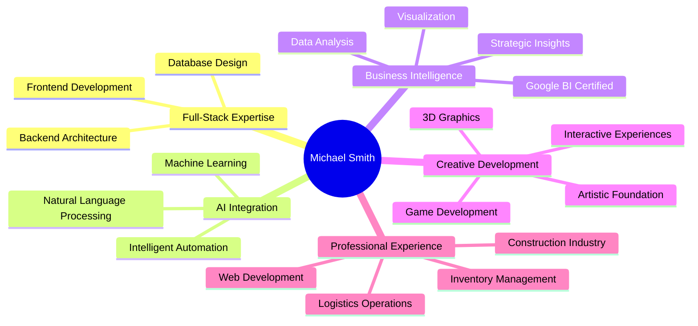

# 👋 Hi, I'm Michael R. Smith

---

## 🚀 About Me

> **Passionate Full-Stack Developer** with expertise spanning web development, AI/ML, business intelligence, and game development. Based 15 miles west of Philadelphia, PA, I bring creativity and technical excellence to every project.

- 💻 **Full-Stack Development**: React, Angular, Django, Node.js, TypeScript
- 🐍 **Python Specialist**: Django, Flask, Data Science, AI/ML
- 🤖 **AI/ML Engineering**: TensorFlow, PyTorch, NLP, LLMs, CrewAI
- 📊 **Business Intelligence**: Power BI, Data Analysis, Excel/VBA
- 🎮 **Game Development**: Three.js, Unity, Blender, Interactive 3D
- 🏆 **Certified in**: A+ | Meta Front-End | Python | AI/ML | C#/.NET | JavaScript
- 💼 **Professional Experience**: Web development, inventory management, logistics optimization
- 🎓 **Education**: Computer Science, Business Intelligence, Art Studies

---

## 🛠️ Tech Stack & Tools

### Frontend Development

### Backend Development

### AI/ML & Data Science

### Tools & Platforms

---

## 📊 GitHub Statistics

  
  

  

---

## 🎓 Professional Background

### 💼 Professional Experience
- **Web Development Specialist** - Creating and maintaining HTML-based webpages with custom owner-provided content
- **Inventory & Logistics Management** - Warehouse inventory control, shipping and receiving operations
- **Construction Materials Coordination** - Managing construction-related materials and supply chain operations

### 🎓 Education & Certifications

| Institution | Program | Year | Focus Area |
|-------------|---------|------|------------|
| **Coursera** | Google Business Intelligence | 2024-2025 | Data Analysis & BI |
| **Zero To Mastery Academy** | Business Intelligence Analysis | June 2024 | Analytics & Insights |
| **Delaware County Community College** | Computer Science | 2004-2005 | Programming & Systems |
| **CHI Institute** | Computer & Information Sciences | 2002-2003 | Technical Foundation |
| **The Woodlynde School** | Art/Art Studies | 1989-2000 | Creative Foundation |

### 🏆 Professional Certifications
- **A+ Certification** - Hardware & Software Troubleshooting
- **Meta Front-End Developer** - Modern Web Development
- **Python Development** - Programming & Automation
- **AI/ML Specialist** - Machine Learning & Data Science
- **C#/.NET Developer** - Enterprise Application Development
- **JavaScript Expert** - Full-Stack Web Development
- **Google Business Intelligence** - Data Analytics & Visualization

---

## 🌟 Featured Projects

### 🤖 AI & Machine Learning

<table>
<tr>
<td width="50%">

**🎯 [Interactive AI Interview Coach](https://github.com/MSMITH71910/Interative_Interview_Coach)**
- Intelligent interview coaching system with CrewAI
- Real-time mock interviews with live grading
- Comprehensive feedback for UX/UI positions
- **Tech**: Python, CrewAI, OpenAI

</td>
<td width="50%">

**💰 [AI-Driven Financial Chatbot](https://github.com/MSMITH71910/AI-Driven-Financial-Chatbot)**
- NLP-powered financial assistant
- Advanced natural language processing
- Financial advice and analysis
- **Tech**: Python, NLP, Machine Learning

</td>
</tr>
<tr>
<td width="50%">

**📈 [GenAI Stock Analysis](https://github.com/MSMITH71910/GenAI-Stock-Analysis)**
- Predictive market modeling system
- AI-powered stock analysis
- Data visualization and insights
- **Tech**: Python, Jupyter, AI/ML

</td>
<td width="50%">

**📄 [AI Resume Builder](https://github.com/MSMITH71910/AI-Resume-Builder)**
- AI-powered resume tailoring tool
- Job description matching
- Intelligent suggestions system
- **Tech**: Python, AI/ML

</td>
</tr>
</table>

### 🎨 Web Development

<table>
<tr>
<td width="50%">

**🛍️ [Crwn Clothing](https://github.com/MSMITH71910/crwn-clothing)**
- Full-featured e-commerce platform
- React-based shopping experience
- Firebase integration
- **Tech**: React, JavaScript, Firebase, SCSS

</td>
<td width="50%">

**🎮 [Clips Gaming Platform](https://github.com/MSMITH71910/Clips_Angular_Gamer_site)**
- Twitch-like streaming platform
- Gaming clip sharing community
- Real-time video processing
- **Tech**: Angular, TypeScript

</td>
</tr>
<tr>
<td width="50%">

**🌟 [CartoonCodeStreet](https://github.com/MSMITH71910/CartoonCodeStreet)**
- Interactive 3D coding environment
- Three.js portfolio showcase
- Immersive web experience
- **Tech**: TypeScript, Three.js

</td>
<td width="50%">

**🌌 [Interactive Solar System](https://github.com/MSMITH71910/interactive_solar_system)**
- Educational 3D solar system simulation
- AI chatbot assistant integration
- Interactive learning experience
- **Tech**: HTML, JavaScript, Three.js

</td>
</tr>
</table>

### 🎯 Specialized Applications

<table>
<tr>
<td width="50%">

**🎬 [Flixify](https://github.com/MSMITH71910/flixify)**
- Movie discovery platform
- Advanced search and filtering
- User-friendly interface
- **Tech**: JavaScript, APIs

</td>
<td width="50%">

**☕ [Discover Coffee Stores](https://github.com/MSMITH71910/discover-coffee-stores)**
- Local coffee shop finder
- Location-based services
- Next.js powered application
- **Tech**: Next.js, TypeScript

</td>
</tr>
<tr>
<td width="50%">

**✈️ [Trip App](https://github.com/MSMITH71910/trip-app)**
- Ultimate travel companion
- Trip planning and management
- User-friendly travel tools
- **Tech**: HTML, Python

</td>
<td width="50%">

**🔗 [Link Shortener](https://github.com/MSMITH71910/my_link_shortener_web-app)**
- Custom URL shortening service
- Analytics and tracking
- Clean, modern interface
- **Tech**: Python, Web Development

</td>
</tr>
</table>

---

## 🎮 Fun & Creative Projects

| Project | Description | Tech Stack | Demo |
|---------|-------------|------------|------|
| [🦔 Sonic Pong](https://github.com/MSMITH71910/Sonic_Pong) | Classic Pong with Sonic theme | JavaScript, HTML5 Canvas | [Play](https://github.com/MSMITH71910/Sonic_Pong) |
| [😂 Joke Teller](https://github.com/MSMITH71910/joke-teller) | Voice-controlled joke application | JavaScript, Web APIs | [Try It](https://github.com/MSMITH71910/joke-teller) |
| [🎨 Pixl Art Editor](https://github.com/MSMITH71910/github.com-MSMITH71910-pixl) | Pixel art creation tool | Golang | [Create](https://github.com/MSMITH71910/github.com-MSMITH71910-pixl) |
| [📺 Picture-in-Picture](https://github.com/MSMITH71910/picture-in-picture) | Browser utility for video | CSS, JavaScript | [Use](https://github.com/MSMITH71910/picture-in-picture) |
| [💭 Quote Generator](https://github.com/MSMITH71910/funny-quote-generator) | Funny quote generator | JavaScript | [Generate](https://github.com/MSMITH71910/funny-quote-generator) |

---

## 📚 Learning & Development Projects

### Python Development
- **[Python Development](https://github.com/MSMITH71910/Python-Development)** - Comprehensive Python projects collection
- **[BookBot](https://github.com/MSMITH71910/bookbot)** - First Boot.dev project, text analysis tool
- **[Link Plant](https://github.com/MSMITH71910/link-plant)** - Link management system

### Business Intelligence
- **[Business Intelligence Analyst](https://github.com/MSMITH71910/Business-Intelligence-Analyst)** - BI portfolio with data analysis projects
- **[Excel Retirement Planner](https://github.com/MSMITH71910/Excel-Retirement-Planner)** - Financial planning tool

### Web Development Practice
- **[Monsters Rolodex](https://github.com/MSMITH71910/monsters-rolodex)** - React learning project
- **[Background Generator](https://github.com/MSMITH71910/Background-Generator-WebPage)** - CSS gradient tool
- **[Simple Portfolio](https://github.com/MSMITH71910/simplefolio)** - Portfolio template
- **[Focus Time](https://github.com/MSMITH71910/FocusTime-)** - Productivity application

---

## 🏆 What I Bring to the Table

### 🎯 Core Strengths
- **🔧 Full-Stack Mastery**: From pixel-perfect UIs to robust backend systems
- **🤖 AI Integration**: Bringing intelligence to web applications
- **📊 Data-Driven**: Turning data into actionable business insights with Google BI expertise
- **🎨 Creative Problem Solving**: Unique solutions combining technical skills with artistic foundation
- **🚀 Performance Optimization**: Building fast, scalable applications
- **🤝 Collaborative Leadership**: Team-oriented development approach
- **📦 Operations Excellence**: Real-world experience in inventory management and logistics
- **🏗️ Industry Knowledge**: Construction materials and supply chain expertise

---

## 📈 Current Focus

- 🔭 Working on advanced AI/ML projects with CrewAI and OpenAI
- 🌱 Exploring cutting-edge web technologies and frameworks
- 👯 Looking to collaborate on innovative full-stack applications
- 💬 Ask me about React, Python, AI/ML, or game development
- ⚡ Fun fact: I love blending creativity with code - from 3D graphics to AI!

---

## 📫 Let's Connect!

---

### 💡 "Innovation distinguishes between a leader and a follower." - Steve Jobs

**Thanks for visiting my profile! Let's build something amazing together! 🚀**

