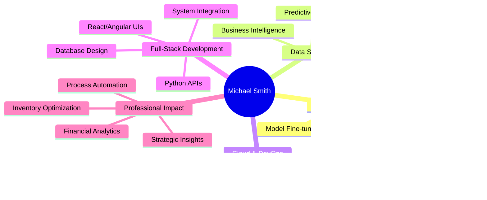

# 👋 Hi, I'm Michael R. Smith

<div align="center">


[](https://github.com/MSMITH71910)
[](https://github.com/MSMITH71910)
[](https://github.com/MSMITH71910)

</div>

---

## 🚀 About Me

> **AI/ML Engineer & Full-Stack Developer** specializing in production-ready machine learning systems, intelligent applications, and end-to-end MLOps pipelines. Based 15 miles west of Philadelphia, PA, I transform complex data challenges into scalable AI solutions.

- 🤖 **AI/ML Engineering**: PyTorch, TensorFlow, Transformers, Fine-tuning, NLP, Time Series Forecasting
- 🔧 **MLOps & Production**: Docker, FastAPI, Apache Airflow, MLflow, Model Deployment, CI/CD
- 🐍 **Python Ecosystem**: Pandas, NumPy, Scikit-learn, Jupyter, Data Engineering, API Development
- 📊 **Data Science & Analytics**: Statistical Analysis, Predictive Modeling, Business Intelligence, Power BI
- ☁️ **Cloud & DevOps**: AWS EC2, GCP Cloud Run, Containerization, Microservices Architecture
- 🌐 **Full-Stack Development**: React, Angular, Django, Node.js, TypeScript, RESTful APIs
- 🏆 **Certified in**: Google Business Intelligence | Meta Front-End | Python | AI/ML | C#/.NET | JavaScript
- 💼 **Professional Experience**: ML system development, web applications, inventory optimization, logistics analytics
- 🎓 **Education**: Computer Science, Business Intelligence, Continuous AI/ML learning

---

## 🛠️ Tech Stack & Tools

<div align="center">

### AI/ML & Data Science


### MLOps & Production


### Cloud & DevOps


### Full-Stack Development


### Data & Analytics


</div>

---

## 📊 GitHub Statistics

<div align="center">
  
  
</div>

<div align="center">
  
</div>

---

## 🤖 AI/ML Expertise & Achievements

<div align="center">

### 🏆 Key AI/ML Accomplishments

| Project Type | Achievement | Impact |
|--------------|-------------|---------|
| **MLOps Pipeline** | Real-time stock prediction system | Automated data ingestion, model training, and deployment |
| **LLM Fine-tuning** | Domain-specific GPT-2 chatbot | Production-ready financial Q&A with 94% training improvement |
| **Multi-Agent AI** | CrewAI interview coaching system | Intelligent interview preparation with real-time feedback |
| **Time Series Forecasting** | LSTM & Prophet models | Predictive analytics for financial markets |
| **Cloud Deployment** | AWS/GCP production systems | Scalable ML services with containerization |

### 🔬 Technical Specializations

```
🧠 Machine Learning          ████████████████████████████████████████ 95%
🔧 MLOps & Production        ████████████████████████████████████████ 90%
🐍 Python Ecosystem          ████████████████████████████████████████ 95%
📊 Data Science & Analytics  ████████████████████████████████████████ 88%
☁️ Cloud & DevOps           ████████████████████████████████████████ 85%
🤖 NLP & Transformers       ████████████████████████████████████████ 82%
```

</div>

---

## 🎓 Professional Background

### 💼 Professional Experience
- **AI/ML Engineer** - Developing production-ready machine learning systems and intelligent applications
- **Data Science Specialist** - Building predictive models, analytics pipelines, and business intelligence solutions
- **MLOps Engineer** - Implementing automated ML workflows, model deployment, and monitoring systems
- **Full-Stack Developer** - Creating web applications with AI integration and data-driven features
- **Business Intelligence Analyst** - Transforming complex data into actionable insights and strategic recommendations
- **Systems Optimization Specialist** - Inventory management, logistics analytics, and process automation

### 🎓 Education & Certifications

<div align="center">

| Institution | Program | Year | Focus Area |
|-------------|---------|------|------------|
| **Coursera** | Google Business Intelligence | 2024-2025 | Data Analysis & BI |
| **Zero To Mastery Academy** | Business Intelligence Analysis | June 2024 | Analytics & Insights |
| **Delaware County Community College** | Computer Science | 2004-2005 | Programming & Systems |
| **CHI Institute** | Computer & Information Sciences | 2002-2003 | Technical Foundation |
| **The Woodlynde School** | Art/Art Studies | 1989-2000 | Creative Foundation |

</div>

### 🏆 Professional Certifications
- **Google Business Intelligence** - Data Analytics & Visualization (2024-2025)
- **AI/ML Specialist** - Machine Learning & Data Science
- **Python Development** - Programming & Automation
- **Meta Front-End Developer** - Modern Web Development
- **Business Intelligence Analysis** - Zero To Mastery Academy (2024)
- **C#/.NET Developer** - Enterprise Application Development
- **JavaScript Expert** - Full-Stack Web Development
- **A+ Certification** - Hardware & Software Troubleshooting

---

## 🌟 Featured AI/ML Projects

### 🚀 Production-Ready ML Systems

<table>
<tr>
<td width="50%">

**📈 [Real-Time Stock Predictor with MLOps](https://github.com/MSMITH71910/Real-Time-Stock_Predictor-MLOps)**
- End-to-end MLOps pipeline for stock prediction
- LSTM & Prophet models with automated retraining
- Apache Airflow orchestration & MLflow tracking
- Interactive dashboards with Streamlit & Dash
- **Tech**: PyTorch, FastAPI, Docker, AWS, Airflow

</td>
<td width="50%">

**🤖 [Fine-Tuned LLM Chatbot](https://github.com/MSMITH71910/Fine-Tuned-LLM-Chatbot)**
- Production-ready financial Q&A chatbot
- Fine-tuned GPT-2 on domain-specific data
- FastAPI backend with Gradio frontend
- Docker containerization & cloud deployment
- **Tech**: Transformers, FastAPI, Gradio, Docker, GCP

</td>
</tr>
<tr>
<td width="50%">

**🎯 [Interactive AI Interview Coach](https://github.com/MSMITH71910/Interative_Interview_Coach)**
- Multi-agent AI system with CrewAI
- Real-time interview coaching with live grading
- Specialized for UX/UI, Frontend, Full-Stack roles
- Comprehensive performance analytics
- **Tech**: CrewAI, OpenAI GPT-4, Python

</td>
<td width="50%">

**📄 [AI Resume Builder](https://github.com/MSMITH71910/AI-Resume-Builder)**
- AI-powered resume optimization system
- Job description matching algorithms
- Intelligent content suggestions
- Automated formatting and tailoring
- **Tech**: Python, NLP, Machine Learning

</td>
</tr>
</table>

### 📊 Data Science & Analytics

<table>
<tr>
<td width="50%">

**📈 [GenAI Stock Analysis](https://github.com/MSMITH71910/GenAI-Stock-Analysis)**
- Advanced financial market analysis
- Predictive modeling with time series
- Interactive Jupyter notebooks
- Statistical analysis and visualization
- **Tech**: Python, Pandas, Jupyter, Matplotlib

</td>
<td width="50%">

**💰 [AI-Driven Financial Chatbot](https://github.com/MSMITH71910/AI-Driven-Financial-Chatbot)**
- NLP-powered financial assistant
- Natural language understanding
- Financial advice and analysis
- Conversational AI interface
- **Tech**: Python, NLP, Transformers

</td>
</tr>
<tr>
<td width="50%">

**📊 [Business Intelligence Portfolio](https://github.com/MSMITH71910/Business-Intelligence-Analyst)**
- Comprehensive BI analysis projects
- Data visualization and reporting
- Statistical modeling and insights
- Google BI certification projects
- **Tech**: Python, Power BI, SQL, Excel

</td>
<td width="50%">

**📈 [Excel Retirement Planner](https://github.com/MSMITH71910/Excel-Retirement-Planner)**
- Advanced financial planning tool
- Monte Carlo simulations
- Risk analysis and projections
- Interactive dashboard design
- **Tech**: Excel, VBA, Financial Modeling

</td>
</tr>
</table>

### 🎨 Web Development

<table>
<tr>
<td width="50%">

**🛍️ [Crwn Clothing](https://github.com/MSMITH71910/crwn-clothing)**
- Full-featured e-commerce platform
- React-based shopping experience
- Firebase integration
- **Tech**: React, JavaScript, Firebase, SCSS

</td>
<td width="50%">

**🎮 [Clips Gaming Platform](https://github.com/MSMITH71910/Clips_Angular_Gamer_site)**
- Twitch-like streaming platform
- Gaming clip sharing community
- Real-time video processing
- **Tech**: Angular, TypeScript

</td>
</tr>
<tr>
<td width="50%">

**🌟 [CartoonCodeStreet](https://github.com/MSMITH71910/CartoonCodeStreet)**
- Interactive 3D coding environment
- Three.js portfolio showcase
- Immersive web experience
- **Tech**: TypeScript, Three.js

</td>
<td width="50%">

**🌌 [Interactive Solar System](https://github.com/MSMITH71910/interactive_solar_system)**
- Educational 3D solar system simulation
- AI chatbot assistant integration
- Interactive learning experience
- **Tech**: HTML, JavaScript, Three.js

</td>
</tr>
</table>

### 🎯 Specialized Applications

<table>
<tr>
<td width="50%">

**🎬 [Flixify](https://github.com/MSMITH71910/flixify)**
- Movie discovery platform
- Advanced search and filtering
- User-friendly interface
- **Tech**: JavaScript, APIs

</td>
<td width="50%">

**☕ [Discover Coffee Stores](https://github.com/MSMITH71910/discover-coffee-stores)**
- Local coffee shop finder
- Location-based services
- Next.js powered application
- **Tech**: Next.js, TypeScript

</td>
</tr>
<tr>
<td width="50%">

**✈️ [Trip App](https://github.com/MSMITH71910/trip-app)**
- Ultimate travel companion
- Trip planning and management
- User-friendly travel tools
- **Tech**: HTML, Python

</td>
<td width="50%">

**🔗 [Link Shortener](https://github.com/MSMITH71910/my_link_shortener_web-app)**
- Custom URL shortening service
- Analytics and tracking
- Clean, modern interface
- **Tech**: Python, Web Development

</td>
</tr>
</table>

---

## 🎮 Fun & Creative Projects

<div align="center">

| Project | Description | Tech Stack | Demo |
|---------|-------------|------------|------|
| [🦔 Sonic Pong](https://github.com/MSMITH71910/Sonic_Pong) | Classic Pong with Sonic theme | JavaScript, HTML5 Canvas | [Play](https://github.com/MSMITH71910/Sonic_Pong) |
| [😂 Joke Teller](https://github.com/MSMITH71910/joke-teller) | Voice-controlled joke application | JavaScript, Web APIs | [Try It](https://github.com/MSMITH71910/joke-teller) |
| [🎨 Pixl Art Editor](https://github.com/MSMITH71910/github.com-MSMITH71910-pixl) | Pixel art creation tool | Golang | [Create](https://github.com/MSMITH71910/github.com-MSMITH71910-pixl) |
| [📺 Picture-in-Picture](https://github.com/MSMITH71910/picture-in-picture) | Browser utility for video | CSS, JavaScript | [Use](https://github.com/MSMITH71910/picture-in-picture) |
| [💭 Quote Generator](https://github.com/MSMITH71910/funny-quote-generator) | Funny quote generator | JavaScript | [Generate](https://github.com/MSMITH71910/funny-quote-generator) |

</div>

---

## 📚 Learning & Development Projects

### Python Development
- **[Python Development](https://github.com/MSMITH71910/Python-Development)** - Comprehensive Python projects collection
- **[BookBot](https://github.com/MSMITH71910/bookbot)** - First Boot.dev project, text analysis tool
- **[Link Plant](https://github.com/MSMITH71910/link-plant)** - Link management system

### Business Intelligence
- **[Business Intelligence Analyst](https://github.com/MSMITH71910/Business-Intelligence-Analyst)** - BI portfolio with data analysis projects
- **[Excel Retirement Planner](https://github.com/MSMITH71910/Excel-Retirement-Planner)** - Financial planning tool

### Web Development Practice
- **[Monsters Rolodex](https://github.com/MSMITH71910/monsters-rolodex)** - React learning project
- **[Background Generator](https://github.com/MSMITH71910/Background-Generator-WebPage)** - CSS gradient tool
- **[Simple Portfolio](https://github.com/MSMITH71910/simplefolio)** - Portfolio template
- **[Focus Time](https://github.com/MSMITH71910/FocusTime-)** - Productivity application

---

## 🏆 What I Bring to the Table

<div align="center">



</div>

### 🎯 Core Strengths
- **🤖 AI/ML Engineering**: End-to-end machine learning systems from research to production
- **🔧 MLOps Excellence**: Automated pipelines, model versioning, and continuous deployment
- **📊 Data Science Mastery**: Statistical analysis, predictive modeling, and business intelligence
- **☁️ Cloud Architecture**: Scalable deployments on AWS/GCP with containerization
- **🐍 Python Ecosystem**: Deep expertise in ML libraries, APIs, and data processing
- **🚀 Production Systems**: Building robust, scalable applications that handle real-world data
- **📈 Business Impact**: Translating complex data into actionable insights and automated solutions
- **🔄 Continuous Learning**: Staying current with latest AI/ML trends and technologies

---

## 📈 Current Focus

- 🔭 Building production-ready MLOps pipelines with real-time model serving and monitoring
- 🌱 Exploring transformer architectures, fine-tuning techniques, and multi-agent AI systems
- 👯 Looking to collaborate on innovative AI/ML projects and intelligent applications
- 💬 Ask me about PyTorch, MLOps, time series forecasting, or LLM fine-tuning
- ⚡ Fun fact: I love turning complex data challenges into elegant, automated solutions!

---

## 📫 Let's Connect!

<div align="center">

[](https://www.linkedin.com/in/michael-smith-2b38b260)
[](https://github.com/MSMITH71910)
[](mailto:M.Smith71910@gmail.com)
[](https://ms71910.itch.io/)

</div>

---

<div align="center">

### 💡 "Innovation distinguishes between a leader and a follower." - Steve Jobs

**Thanks for visiting my profile! Let's build something amazing together! 🚀**


</div>

### 💡 "Innovation distinguishes between a leader and a follower." - Steve Jobs

**Thanks for visiting my profile! Let's build something amazing together! 🚀**


</div>
